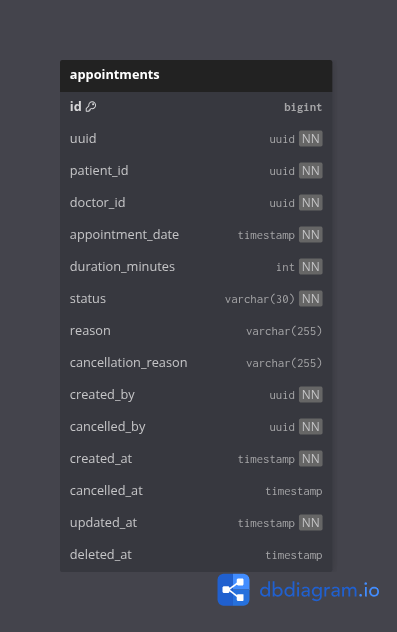
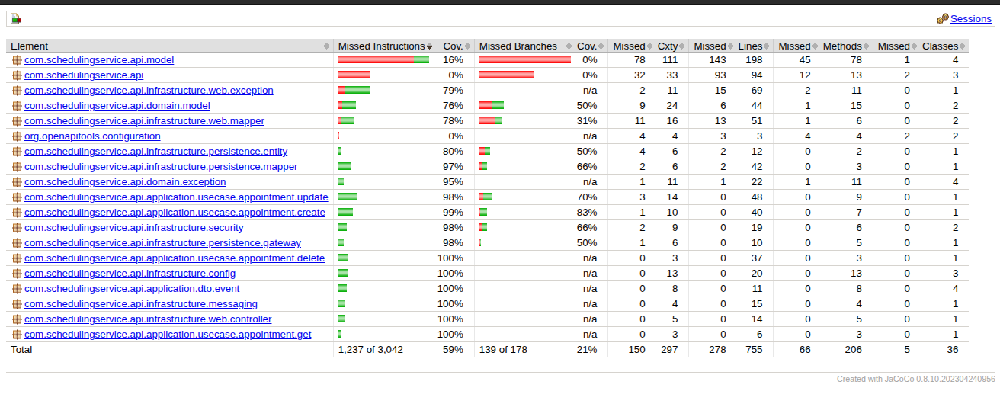

# Scheduling Service

Microsserviço de domínio central responsável pela gestão, criação e modificação de agendamentos de consultas médicas no ecossistema de saúde.

## Descrição do projeto

> Problema
>
> Em um ambiente hospitalar, é essencial contar com sistemas que garantam o agendamento eficaz de consultas, o gerenciamento do histórico de pacientes e o envio de lembretes automáticos para garantir a presença dos pacientes nas consultas. Este sistema deve ser acessível a diferentes tipos de usuários (médicos, enfermeiros e pacientes), com acesso controlado e funcionalidades específicas para cada perfil.
>
> Objetivo
>
> O objetivo é desenvolver um backend simplificado e modular, com foco em segurança e comunicação assíncrona, garantindo que o sistema seja escalável, seguro e que utilize boas práticas de autenticação, autorização e comunicação entre serviços.

## Stack

- Java 21
- Spring Boot 3.5.x
- Spring Web, Spring Data JPA e Validation
- Flyway
- PostgreSQL
- OpenAPI Generator
- Docker e Docker Compose

## Arquitetura - Solução


## Arquitetura - Clean Architecture


## Diagrama de banco de dados



## Kafka

| Topico | Consumer/Producer | Consumer group |
| --- | --- |----------------|
| `scheduling.appointment.notification` | Producer | -              |
| `scheduling.appointment.scheduled` | Producer | -              |

## Cobertura de testes



## Como funciona o contract first

Este projeto usa o arquivo OpenAPI como fonte de verdade para a API:

- contrato principal: `src/main/resources/openapi/scheduling-service-api.yaml`
- o `pom.xml` configura o `openapi-generator-maven-plugin`
- as interfaces e modelos gerados são usados pela aplicação
- a implementação deve seguir o contrato, e não o contrário

### Fluxo recomendado

1. Atualize o contrato em `src/main/resources/openapi/scheduling-service-api.yaml`
2. Gere os artefatos com Maven
3. Implemente os controllers, use cases e adapters seguindo as interfaces geradas
4. Valide com testes

### Gerar código a partir do contrato

```bash
./mvnw clean generate-sources
```

Se preferir, também é possível executar uma compilação completa:

```bash
./mvnw clean compile
```

## Execução com Docker

> Antes de subir a aplicação, renomeie o arquivo `.env.sample` para `.env` e ajuste as variáveis conforme o seu ambiente.

### Subir a aplicação e o banco

```bash
docker compose up -d --build
```

### Verificar os containers

```bash
docker compose ps
```

### Parar os serviços

```bash
docker compose down
```

## Comandos básicos de compilação

```bash
./mvnw clean compile
./mvnw clean package -DskipTests
```

## Testes

### Executar a suíte de testes

```bash
./mvnw test
```

### Executar os testes com build completo

```bash
./mvnw clean test
```

### Executar os testes com cobertura de código

```bash
mvn clean test jacoco:report
```

## Endpoints úteis

- Health check: `GET /actuator/health`
- Documentação OpenAPI: `GET /v3/api-docs`
- Swagger UI: `GET /swagger-ui.html`

## Collection Postman

[scheduling-service.postman_collection.json](docs/scheduling-service.postman_collection.json)

## Variáveis de ambiente principais

- `POSTGRES_DB`
- `POSTGRES_USER`
- `POSTGRES_PASSWORD`
- `SERVER_PORT`
- `DB_HOST`
- `DB_USERNAME`
- `DB_PASSWORD`
- `JPA_SHOW_SQL`

## Estrutura resumida

- `src/main/java/` - código-fonte da aplicação
- `src/main/resources/application.yaml` - configuração do Spring Boot
- `src/main/resources/openapi/scheduling-service-api.yaml` - contrato da API
- `src/main/resources/db/migration/` - migrações do Flyway
- `docker-compose.yml` - ambiente local com PostgreSQL e aplicação

## Observações

- O banco de dados usa o schema `scheduling-service`.
- O projeto implementa Clean Architecture, separando domínio, aplicação e infraestrutura.
